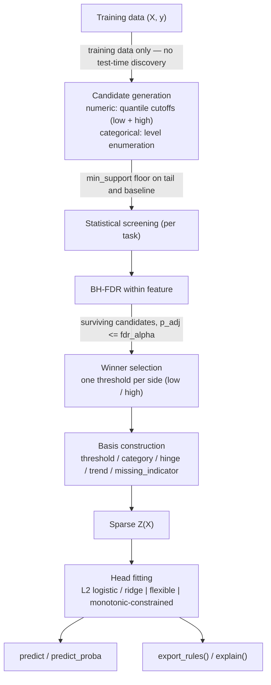

# How FlagGAM builds a model

FlagGAM's promise is that the model you inspect *is* the model that predicts. There is no
post-hoc approximation step between "what the model learned" and "what the model says":
every prediction is the exact sum of an intercept and the contributions of named,
individually screened rules.

This article walks the whole pipeline for one training set: how candidate cutoffs are
generated, how each is tested against the outcome, how multiple testing is corrected, how
winners become basis functions, and how the additive head turns the basis matrix into
predictions and reason codes. Each stage links to the design decision that fixed its
behavior.

!!! example "Running example"
    A small credit dataset with a numeric `age` and a categorical `purpose` column, and a
    planted signal: applicants under 30 and `edu`-purpose loans default more often. The
    question for FlagGAM: *which concrete conditions — `age <= c`, `purpose == level` —
    carry statistically defensible signal, and what weight does each earn in the final
    score?* The snippets below are the [getting started](getting-started.md) example.

The model FlagGAM fits is a generalized additive model over binary (and a few ramp) basis
functions. For a row $x$, the raw score — a logit for classification, the response for
regression — is

$$
s(x) \;=\; \beta_0 \;+\; \sum_{j} \beta_j \, z_j(x),
$$

where each $z_j$ is a concrete, named condition such as $\mathbf{1}\{\text{age} \le
27.4\}$ and $\beta_j$ is its fitted weight. Screening decides *which* $z_j$ exist;
head fitting decides their weights. Screening happens once, on the training split only —
at prediction time the discovered bases are simply re-evaluated on new rows.

The pipeline, end to end — every stage below gets its own section:



## Candidate generation

For each numerical feature, candidate cutoffs are drawn from two quantile grids — a "low"
side and a "high" side — evaluated on the observed (non-missing) training values:

- `quantile_low = (0.05, 0.45)`, stepped by `quantile_step = 0.05`: `0.05, 0.10, ..., 0.45`
- `quantile_high = (0.55, 0.95)`, stepped by `quantile_step = 0.05`: `0.55, 0.60, ..., 0.95`

Each low-side quantile becomes a candidate `x <= cutoff`; each high-side quantile becomes
a candidate `x >= cutoff`. Duplicate `(cutoff, side)` pairs (e.g. from a feature with
repeated values) are dropped before screening. A feature is skipped entirely if it has
fewer than `2 * min_support` non-missing observations.

For categorical features, every observed level (`pd.unique` of the non-missing column) is
a candidate `x == level`.

`min_support` is the floor on how many observations must fall on the tail side of a
candidate (and, symmetrically, on the baseline side — see
[winner selection](#fdr-and-winner-selection)). By default (`min_support="auto"`), it is
computed from the training size, verbatim from `screening.compute_min_support`:

$$
\texttt{min\_support} \;=\; \min\bigl(200,\; \max(20,\; \lceil 0.02 \, n_{\text{train}} \rceil)\bigr)
$$

i.e. 2% of the training rows, floored at 20 and capped at 200. Pass an explicit integer
to `min_support` to override it.

## Statistical screening

Each candidate is tested by comparing the "tail" (rows satisfying the candidate
condition) against the "baseline" (all other rows) — the baseline is always the
complement of the tail, never a "central-only" region ([DECISIONS 2](DECISIONS.md)).

**Classification** (`task="binary"` or `"multiclass"`):

- **Binary outcome** — a two-sided two-proportion z-test (`screening.two_proportion_test`)
  compares the positive-class rate in the tail vs. the baseline. When any expected cell
  count in the 2x2 table is below 5, the test falls back to Fisher's exact test
  automatically, with no user-facing switch ([DECISIONS 3](DECISIONS.md)). Effect size is
  the absolute risk difference (`effect_size="risk_difference"`, the default) or the
  absolute log-odds ratio (`effect_size="log_odds_ratio"`).
- **Multiclass outcome** — a Pearson chi-square test (`screening.chi_square_test`) on the
  2xK (tail/baseline x class) contingency table, since no single directional effect is
  defined for K > 2 classes. Effect size is Cramer's V of that table.

For both, the **enriched class** is the class the tail is disproportionately associated
with: for binary outcomes, whichever class (0 or 1) has the higher rate in the tail than
in the baseline; for multiclass, the class with the largest tail-rate-to-baseline-rate
ratio (`argmax(rate_tail / rate_base)`). It is recorded per basis and drives which class a
flag's contribution is attributed to under `representation="compact"`
([the additive head](#the-additive-head)).

**Regression**:

- A Welch t-test (`screening.welch_t_test`, unequal variances) on the continuous
  response, tail vs. baseline. Effect size is the absolute standardized mean difference
  (SMD, `screening.standardized_mean_difference`, pooled/averaged variance). Ranking by
  |SMD| lets effect size drive selection even when the two sides have very different
  sample sizes and thus different statistical power ([DECISIONS 5](DECISIONS.md)).

## FDR and winner selection

A feature's candidates on the same side (`"low"` or `"high"`, or all levels for a
categorical feature) are BH-adjusted together (`screening.bh_adjust`) before filtering by
`fdr_alpha` (default `0.05`). This keeps the reported `p_adj` honest about how many
candidates were tried for that feature. Missing-indicator screening
([missing values](concepts/missing-values.md)) is a separate pool: one candidate per
feature, BH-corrected across features rather than within one.

Among the candidates on a given side that survive `p_adj <= fdr_alpha`, exactly one
becomes the winning basis for that side — so a numeric feature contributes at most one
`low` and one `high` threshold (or hinge, for regression), never a whole grid of them.
The winner is chosen by `max` over `(effect_size, -p_value, -cutoff)`: largest effect
size first, ties broken by smallest p-value, remaining ties broken by the lowest cutoff
([DECISIONS 11](DECISIONS.md)). For categorical features every surviving level becomes
its own `category` basis — there is no per-side collapse, since levels are not ordered.

Both the tail and the baseline must independently satisfy `min_support` for a candidate
to be tested at all ([DECISIONS 10](DECISIONS.md)); for categorical levels the "rest"
group plays the role of the baseline ([DECISIONS 12](DECISIONS.md)).

## Basis construction

Each surviving candidate becomes one column of `Z(X)`, an instance of a `Basis` subclass.
NaN/`None` input never causes a basis to fire — every transform maps missing input to
`0.0` — except `missing_indicator`, whose entire purpose is to detect missingness:

| Kind | Formula | Produced by | Missing `x` input |
|------|---------|-------------|--------------------|
| `threshold_low` / `threshold_high` | `1{x <= c}` (low) / `1{x >= c}` (high) | classification, numeric features | `0.0` (never fires) |
| `hinge_low` / `hinge_high` | `(c - x)_+` (low) / `(x - c)_+` (high) | regression, numeric features | `0.0` (never fires) |
| `category` | `1{x == level}` | classification and regression, categorical features | `0.0` (never fires) |
| `trend` | `x - mean(x)` (centered, added unconditionally, not screened) | regression, numeric features | `0.0`, equivalent to imputing the feature mean ([DECISIONS 9](DECISIONS.md)) |
| `missing_indicator` | `1{x is missing}` | any task, only when `missing="indicator"` | fires (`1.0`) exactly when `x` is missing |

`est.core_.bases_` holds the full list of fitted `Basis` objects; each exposes
`.feature`, `.kind`, `.name` (the rendered rule string), and `.transform(x)`, plus
kind-specific fields (`.cutoff`/`.side` for threshold/hinge, `.level` for category,
`.mean` for trend). See the [API reference](api.md#bases) for the full reference.

## The additive head

`Z(X)` — the sparse matrix of all discovered basis evaluations — is passed
unstandardised to the prediction head ([DECISIONS 8](DECISIONS.md)):

- **Additive head** (`head="additive"`, the default) — an L2-penalized logistic
  regression (classification, parameter `C`) or ridge regression (regression, parameter
  `alpha`) fit directly on `Z(X)`. Passing a list for `C`/`alpha` switches to the
  cross-validated variant (`LogisticRegressionCV` with `cv=5`, scoring `roc_auc` for
  binary targets or `neg_log_loss` for multiclass; `RidgeCV`) which selects the best
  value internally.
- **Flexible head** (`head="flexible"`) — any user-supplied scikit-learn estimator (e.g.
  a tree ensemble), cloned and fit directly on `Z(X)` with no access to the raw features;
  this trades away per-rule additive coefficients (`export_rules()`/`explain()` mark it
  `additive_interpretable=False`) for a more flexible fit on the same rule basis.
- **Monotonic-constrained head** (`monotonic_constraints={feature: +1|-1|0}`) — a
  drop-in replacement for the additive head that box-constrains each basis coefficient's
  sign via `scipy.optimize.minimize(method="L-BFGS-B")`. Because every numeric feature's
  bases are themselves monotone step/ramp functions of `x`, constraining the coefficient
  sign gives *exact* monotonicity of that feature's additive contribution, not a
  heuristic approximation ([monotonicity](concepts/monotonicity.md),
  [DECISIONS 20](DECISIONS.md)).
- **Compact representation** (`representation="compact"`) — instead of feeding the full
  `Z(X)` to the head, collapses it into an `(n, K)` matrix of per-class, optionally
  feature-weighted sums of triggered flags (`weighting.compact_scores`); hinge and trend
  bases are excluded since they have no enriched class to attribute to. This trades away
  per-rule coefficients entirely — `export_rules()` and `explain()` raise `ValueError`
  under `representation="compact"`, since the head's weights are per-class scores, not
  per-basis weights.

## From model to explanation

`export_rules()` (requires `representation="full"`) returns one row per surviving basis
from `core_.metadata()`, with the fitted `weight` (the head's coefficient) and an
`additive_interpretable` flag appended. `explain(X)` re-evaluates `Z(X)` on new rows and
decomposes each prediction into `coefficient * Z[i, j]` per fired basis, plus the
intercept, sorted by contribution magnitude — the same additive terms that
`export_rules()` reports, applied row by row.

For the running example:

```python
rules = clf.export_rules()
print(rules[["feature", "rule", "weight"]])
#      feature             rule    weight
#          age   age <= 27.4074  1.589593
#          age   age >= 46.7581 -0.387614
#      purpose purpose == 'edu'  0.906901
#      purpose  purpose == 'tv' -0.418348
#      purpose purpose == 'car' -0.486362

# Attribution for a young 'edu' applicant
x_young = pd.DataFrame({"age": [22.0], "purpose": pd.Categorical(["edu"])})
explanation = clf.explain(x_young)
print(explanation)
#    row     feature             rule  value  contribution
#      0         age   age <= 27.4074    1.0      1.589593
#      0     purpose purpose == 'edu'    1.0      0.906901
#      0 <intercept>      <intercept>    1.0     -0.624096
```

The prediction for this row is the sum of the printed contributions: two flags fired
(`age <= 27.4`, `purpose == 'edu'`), and their weights plus the intercept sum to the
model's logit for this applicant.

## Where to go next

- [Rules and screening](concepts/rules-and-screening.md) — the screening stage in brief.
- [Missing values](concepts/missing-values.md) — the no-evidence default and screened
  missing indicators.
- [Calibration](concepts/calibration.md), [monotonicity](concepts/monotonicity.md),
  [fairness](concepts/fairness.md) — the extensions for regulated settings.
- [Benchmarks](concepts/benchmarks.md) — reproducing the paper's tables.
- [Visualization](concepts/visualization.md) — plots and the interactive explorer.
- [German Credit walkthrough](notebooks/german_credit.ipynb) — everything above on a
  real dataset.
- [API reference](api.md).
